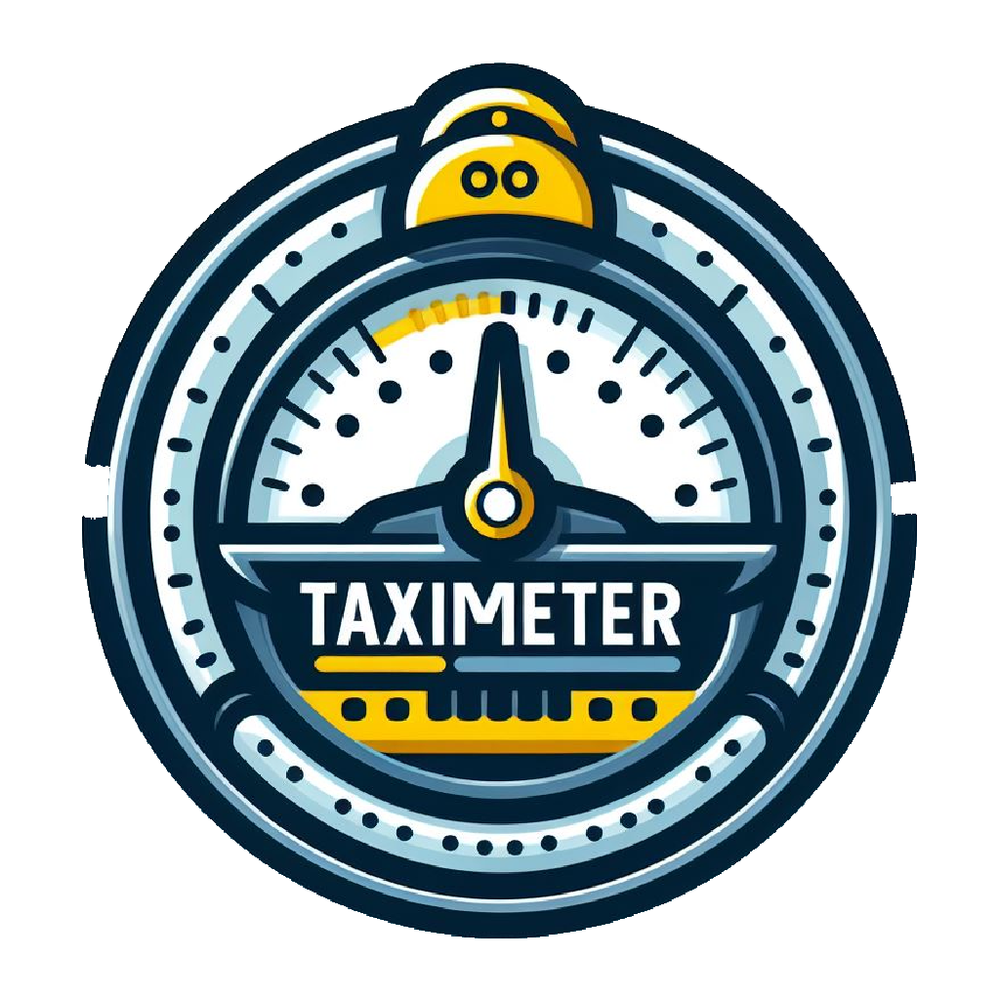
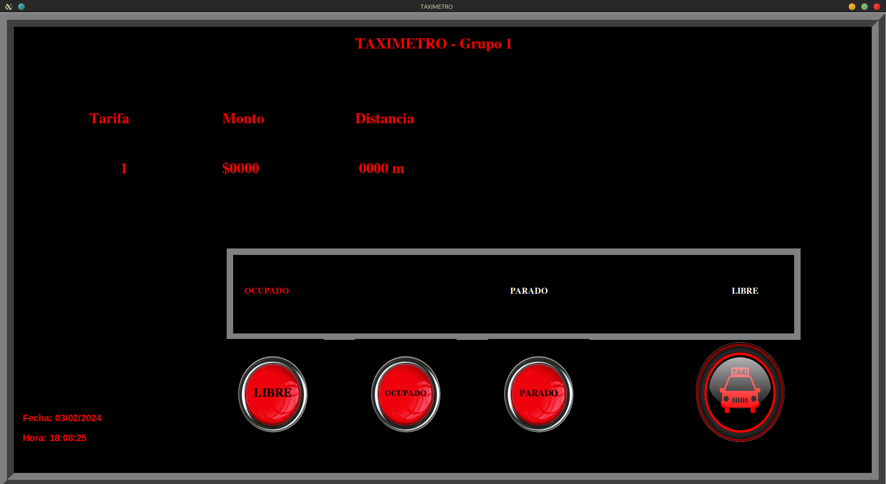
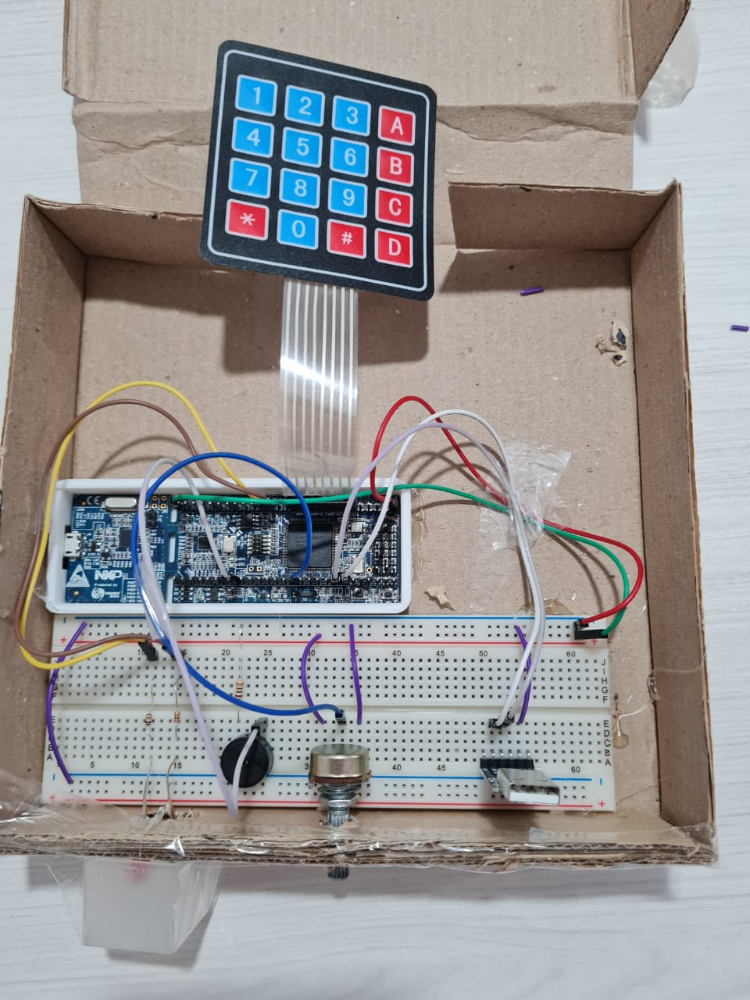

<!-- Improved compatibility of back to top link: See: https://github.com/othneildrew/Best-README-Template/pull/73 -->
<a name="readme-top"></a>
<!--
*** Thanks for checking out the Best-README-Template. If you have a suggestion
*** that would make this better, please fork the repo and create a pull request
*** or simply open an issue with the tag "enhancement".
*** Don't forget to give the project a star!
*** Thanks again! Now go create something AMAZING! :D
-->


<!-- PROJECT SHIELDS -->
<!--
*** I'm using markdown "reference style" links for readability.
*** Reference links are enclosed in brackets [ ] instead of parentheses ( ).
*** See the bottom of this document for the declaration of the reference variables
*** for contributors-url, forks-url, etc. This is an optional, concise syntax you may use.
*** https://www.markdownguide.org/basic-syntax/#reference-style-links
-->
[![Contributors][contributors-shield]][contributors-url]
[![Forks][forks-shield]][forks-url]
[![Stargazers][stars-shield]][stars-url]
[![Issues][issues-shield]][issues-url]
[![MIT License][license-shield]][license-url]
[![LinkedIn][linkedin-shield]][linkedin-url]


<!-- PROJECT LOGO -->
<br />
<div align="center">
  <a href="https://github.com/Fran-cio/taximeterCortexM3">
    
  </a>

<h3 align="center">taximeterCortexM3</h3>

  <p align="center">
    Project of a taximeterCortexM3 implemented on Cortex M3.
    <br />
    <a href="https://github.com/Fran-cio/taximeterCortexM3"><strong>Explore the docs »</strong></a>
    <br />
    <br />
    <a href="https://github.com/Fran-cio/taximeterCortexM3/taximeterCortexM3">View Demo</a>
    ·
    <a href="https://github.com/Fran-cio/taximeterCortexM3/issues">Report Bug</a>
    ·
    <a href="https://github.com/Fran-cio/taximeterCortexM3/issues">Request Feature</a>
  </p>
</div>


<!-- TABLE OF CONTENTS -->
<details>
  <summary>Table of Contents</summary>
  <ol>
    <li>
      <a href="#about-the-project">About The Project</a>
      <ul>
        <li><a href="#built-with">Built With</a></li>
      </ul>
    </li>
    <li>
      <a href="#getting-started">Getting Started</a>
      <ul>
        <li><a href="#graphic-interface">Graphic Interface</a></li>
        <li><a href="#hardware-design">Hardware Design</a></li>
      </ul>
    </li>
    <li><a href="#usage">Usage</a></li>
    <li><a href="#contributing">Contributing</a></li>
    <li><a href="#license">License</a></li>
    <li><a href="#contact">Contact</a></li>
    <li><a href="#acknowledgments">Acknowledgments</a></li>
  </ol>
</details>


<!-- ABOUT THE PROJECT -->
## About The Project
<div align=center>
    
</div>
<br>
The objective of this project is to put into practice the skills using the peripherals of the CORTEX M3 LPC1769. The firmware of the project was developed in C.

For a comprehensive analysis of the project, it is proposed to review [the academic report](INFORME.md), which contains all the theoretical concepts and design decisions of the project.
<p align="right">(<a href="#readme-top">back to top</a>)</p>

### Built With


<p align="right">(<a href="#readme-top">back to top</a>)</p>


<!-- GETTING STARTED -->
## Getting Started
The project was designed using the MCUXpresso IDE from NXP.
### Graphic Interface
For the graphic interface, you should pre-install the following libraries:
- [Tkinter](https://docs.python.org/es/3/library/tkinter.html)
- [Pillow](https://pypi.org/project/pillow/)
- [pySerial](https://pypi.org/project/pyserial/)

Then execute the Python script.
```sh
python proyecto/Taximetro/int_grafica.py
```

### Hardware Design
Of course, you may tailor the implementation according to your objectives and elements. However, a simple purpose could be as follows:

<div align=center> 
    <a href="Imagen/vista_fisica.jpeg"></a>
    <a href="Imagen/vista_logica.jpeg"></a>
</div>

<p align="right">(<a href="#readme-top">back to top</a>)</p>


<!-- USAGE EXAMPLES -->
## Usage
The taxi meter has 3 modes:

1. **Free**: Initially, the taxi meter is in the Free mode. This is indicated by the LED being on. When the "2" button is pressed, the mode changes to Occupied.

2. **Occupied**: In this mode, the red LED turns on, indicating that the taxi is occupied. The fare starts at $90 and increases by $9 every 200 meters, for every 1 minute with the car stopped, or when the "D" button is pressed. 

3. **Stop**: When the journey ends, the "3" button is pressed to switch to the Stop mode. In this mode, the LED starts flashing, indicating that the journey is completed and payment can be collected. Pressing the "1" button in this mode will transition back to the Free mode, allowing the taxi to be available for the next ride.

Additionally, the LED can be turned off by pressing the "4" button.

The data is transmitted via UART with the following format:

```
\rM $<fare> <distance>m
```

- `\r`: Indicates the start of the message.
- `M`: Denotes that the message is from the taxi meter.
- `$<fare>`: Represents the fare, which is preceded by a dollar sign ('$'). For example, "$90".
- `<distance>m`: Indicates the distance traveled, followed by the letter 'm' to denote meters. For example, "200m".
<p align="right">(<a href="#readme-top">back to top</a>)</p>


<!-- CONTRIBUTING -->
## Contributing

Contributions are what make the open source community such an amazing place to learn, inspire, and create. Any contributions you make are **greatly appreciated**.

If you have a suggestion that would make this better, please fork the repo and create a pull request. You can also simply open an issue with the tag "enhancement".
Don't forget to give the project a star! Thanks again!

1. Fork the Project
2. Create your Feature Branch (`git checkout -b feature/AmazingFeature`)
3. Commit your Changes (`git commit -m 'Add some AmazingFeature'`)
4. Push to the Branch (`git push origin feature/AmazingFeature`)
5. Open a Pull Request

<p align="right">(<a href="#readme-top">back to top</a>)</p>


<!-- LICENSE -->
## License

Distributed under the Beerware License🍻. See `LICENSE.txt` for more information.

<p align="right">(<a href="#readme-top">back to top</a>)</p>


<!-- CONTACT -->
## Contact

Francisco Ciordia Cantarella - francisco.ciordia.cantarella@gmail.com

Project Link: [https://github.com/Fran-Cio/taximeterCortexM3](https://github.com/Fran-Cio/taximeterCortexM3)

<p align="right">(<a href="#readme-top">back to top</a>)</p>


<!-- ACKNOWLEDGMENTS -->
## Acknowledgments

* [MCUXpresso IDE](https://www.nxp.com/design/design-center/software/development-software/mcuxpresso-software-and-tools-/mcuxpresso-integrated-development-environment-ide:MCUXpresso-IDE)
* [CMSIS V2 Driver](https://github.com/samuelpereira7/FreeRTOS_LPC17xx_CMSISv2p00/tree/master/CMSISv2p00_LPC17xx)
* [Pretty Badges](https://github.com/Ileriayo/markdown-badges)
* [Logo Generator](https://www.bing.com/Imagen/create?FORM=BICMB1&ssp=1&darkschemeovr=0&setlang=es-CL&safesearch=moderate&toWww=1&redig=8195C3604CE2443CAD2B9B2FB3512087)
* [Template of this readme](https://github.com/othneildrew/Best-README-Template?tab=readme-ov-file)

<p align="right">(<a href="#readme-top">back to top</a>)</p>


<!-- MARKDOWN LINKS & Imagen -->
<!-- https://www.markdownguide.org/basic-syntax/#reference-style-links -->
[contributors-shield]: https://img.shields.io/github/contributors/Fran-Cio/taximeterCortexM3.svg?style=for-the-badge
[contributors-url]: https://github.com/Fran-cio/taximeterCortexM3/graphs/contributors
[forks-shield]: https://img.shields.io/github/forks/Fran-cio/taximeterCortexM3.svg?style=for-the-badge
[forks-url]: https://github.com/Fran-Cio/taximeterCortexM3/network/members
[stars-shield]: https://img.shields.io/github/stars/Fran-Cio/taximeterCortexM3.svg?style=for-the-badge
[stars-url]: https://github.com/Fran-Cio/taximeterCortexM3/stargazers
[issues-shield]: https://img.shields.io/github/issues/Fran-Cio/taximeterCortexM3.svg?style=for-the-badge
[issues-url]: https://github.com/Fran-Cio/taximeterCortexM3/issues
[license-shield]: https://img.shields.io/badge/license-Beerware%F0%9F%8D%BB-green?style=for-the-badge
[license-url]: https://github.com/Fran-Cio/taximeterCortexM3/blob/master/LICENSE.txt
[linkedin-shield]: https://img.shields.io/badge/-LinkedIn-black.svg?style=for-the-badge&logo=linkedin&colorB=555
[linkedin-url]: https://www.linkedin.com/in/francisco-ciordia-cantarella-5323461b8/
[product-screenshot]: Imagen/vista_fisica.jpeg
[usage-example]: Imagen/example.png


